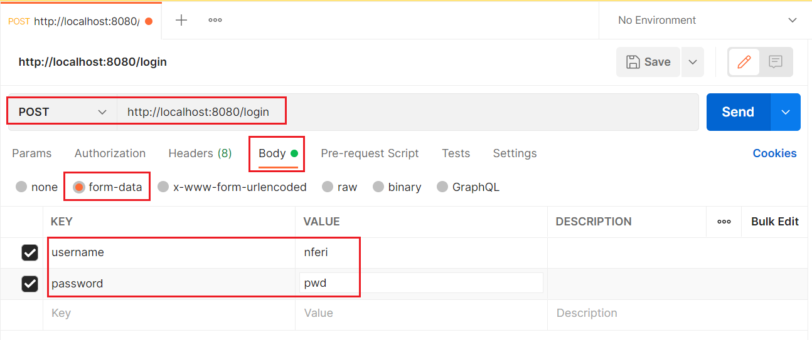
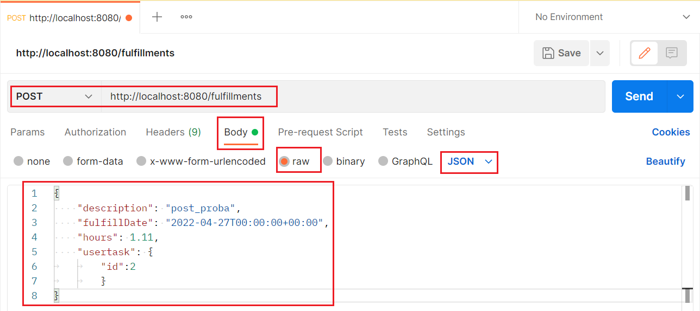

<div id="top"></div>

<!-- PROJECT LOGO -->
<br />
<!-- div align="center">
  <!-- a href="https://github.com/gondoni/timetracker">
    <!-- img src="images/logo.png" alt="Logo" width="80" height="80">
  <!-- /a>

<h3 align="center">Timetracker backend code</h3>

  <p align="center">
    project_description
    <br />
    <a href="https://github.com/gondoni/timetracker"><strong>Explore the code »</strong></a>
    <br />
    <br />
    <a href="https://github.com/gondoni/timetracker/issues">Report Bug</a>
    ·
    <a href="https://github.com/gondoni/timetracker/issues">Request Feature</a>
  </p>
</div>


<!-- TABLE OF CONTENTS -->
<details>
  <summary>Table of Contents</summary>
  <ol>
    <li>
      <a href="#about-the-project">About The Project</a>
      <ul>
        <li><a href="#built-with">Built With</a></li>
      </ul>
    </li>
    <li>
      <a href="#getting-started">Getting Started</a>
      <ul>
        <li><a href="#prerequisites">Prerequisites</a></li>
        <li><a href="#installation">Installation</a></li>
      </ul>
    </li>
    <li><a href="#usage">Usage</a></li>
    <li><a href="#roadmap">Roadmap</a></li>
    <li><a href="#license">License</a></li>
    <li><a href="#contact">Contact</a></li>
  </ol>
</details>


<!-- ABOUT THE PROJECT -->
## About The Project

Timetracker Spring Boot application is my first training exercise to learn using Spring Boot, Docker, MySQL, Postman.

<p align="right">(<a href="#top">back to top</a>)</p>


### Built With

* [Spring Boot](https://spring.io/projects/spring-boot/)
* [Spring Tools Suite](https://spring.io/tools/)
* [Docker](https://www.docker.com/)
* [MySQL](https://www.mysql.com/)
* [MySQL Workbench](https://www.mysql.com/products/workbench/)
* [Postman](https://www.postman.com/)

<p align="right">(<a href="#top">back to top</a>)</p>

<!-- GETTING STARTED -->
## Getting Started

### Prerequisites

You need the followings:
1. IDE to handle Spring Boot source code, for example the [Spring Tools Suite](https://spring.io/tools/).
2. [Docker](https://www.docker.com/) container environment
3. Any browser for login procedure and GET request tests
4. [Postman](https://www.postman.com/) for POST (and any) request tests

### Installation

1. Clone the repo to the Workspace of your IDE
   ```sh
   git clone https://github.com/gondoni/timetracker.git
   ```
2. At first time, once, run the timetracker/mysql/mysql_run.bat file. It makes and starts the MySQL Docker container environment (named timetracker-mysql) and all of its initialization with the timetracker_init.sql file.
   ```sh
   mysql_run.bat
   ```

<p align="right">(<a href="#top">back to top</a>)</p>

## Usage

1. Run the Timetracker Spring Boot App. Tomcat webserver starts at localhost:8080
2. Browse this web address:
   ```sh
   http://localhost:8080/
   ```
At first, it redirects you to the login site: [http://localhost:8080/login](http://localhost:8080/login)
You can login with usernames and passwords of the user table stored in the MySQL database. Example usernames: 'nferi', 'kvili', 'totto', with the same password: 'pwd'.

3. After login, visit these websites for the specified GET requests:
* [http://localhost:8080/projects](http://localhost:8080/projects) - it gives JSON objects with projects of the signed in user
* [http://localhost:8080/tasks](http://localhost:8080/tasks) - it gives JSON objects with tasks of the signed in user
* [http://localhost:8080/fulfillments](http://localhost:8080/fulfillments) - it gives JSON objects with fulfillments of the signed in user

4. Testing POST requests you need to use, for example [Postman](https://www.postman.com/)
* To login send a POST request, with body containing username and password as form-data keys and values:

    
    
* To insert/edit fulfillments send a POST request, with body containing details as JSON raw data:
* 
    
  
  Copy this JSON object example:
   ```sh
   {
    "description": "post_proba",
    "fulfillDate": "2022-04-27T00:00:00+00:00",
    "hours": 1.11,
    "usertask": {
		  "id": 2
		  }
   }
   ```

<p align="right">(<a href="#top">back to top</a>)</p>

<!-- ROADMAP -->
## Roadmap

See the [open issues](https://github.com/gondoni/timetracker/issues) for a full list of proposed features (and known issues).

<p align="right">(<a href="#top">back to top</a>)</p>

<!-- LICENSE -->
## License

Distributed under the [Moon42 Ltd.](https://www.moon42.com/) License. See `LICENSE.txt` for more information.

<p align="right">(<a href="#top">back to top</a>)</p>

<!-- CONTACT -->
## Contact

István Gondon - istvan.gondon@moon42.com
Project Link: [https://github.com/gondoni/timetracker](https://github.com/gondoni/timetracker)

<p align="right">(<a href="#top">back to top</a>)</p>